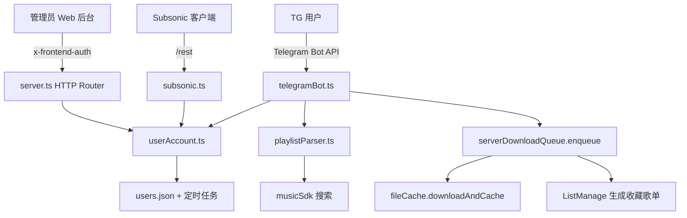
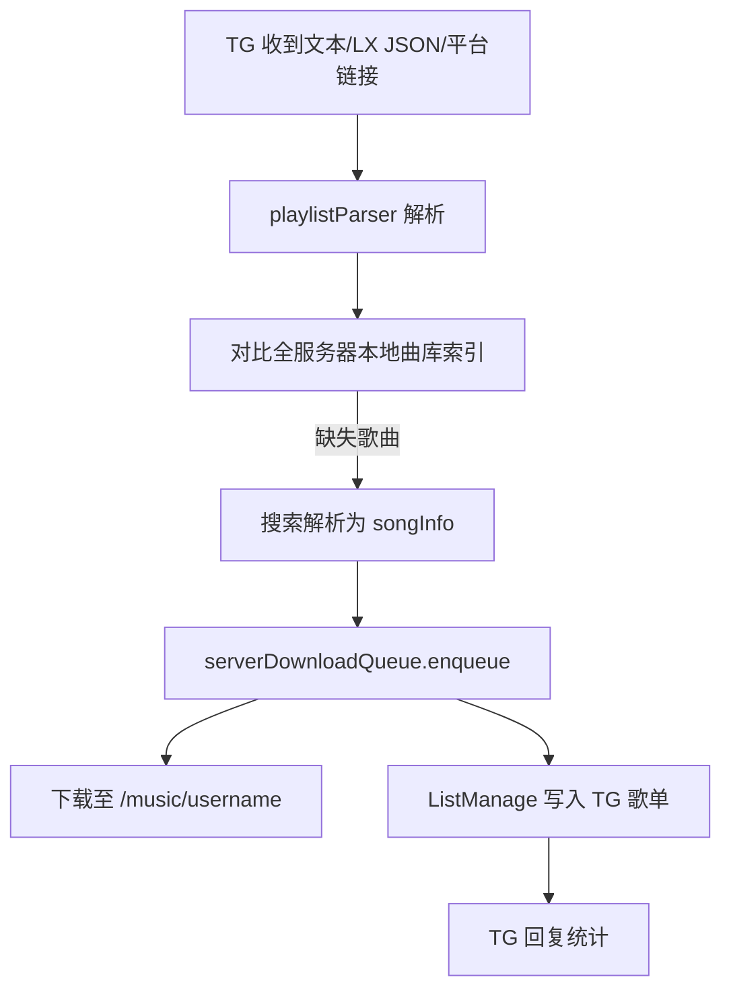

# 技术设计：对外开放用户注册与 TG 机器人

Feature Name: public-user-access-and-telegram-bot
Updated: 2026-08-10

## Description

将 lx-music-sync-server 改造为对外开放注册形态：

1. Web 播放端仅管理员（后台密码 `frontend.password`）可登录，普通用户被拒。
2. 账号生命周期管理：有效期（7/30/365/永久）、30 天周期活跃 ≥5 分钟自动续期、管理后台手动续期、超期/封禁统一拦截。
3. 记录并展示用户活跃时间；可配置 N 天无活跃自动封禁。
4. 新增 TG 机器人：卡密注册、`/bind` 绑定、改密、获取线路、接收歌单（文本/LX JSON/平台链接）并自动下载生成用户收藏歌单。

## Architecture

### 模块总览



### TG 歌单处理数据流



## Components and Interfaces

### 1. `src/server/userAccount.ts`（新增，账号状态中枢）

集中账号生命周期策略，被 server.ts、subsonic.ts、telegramBot.ts 调用。

| 接口 | 说明 |
|---|---|
| `initAccountManager()` | 加载扩展字段（兼容旧数据默认值），启动定时任务（每日扫描：自动续期 + 自动封禁） |
| `registerUser(name, password, cardCode, telegramId?)` | 卡密校验 + 创建用户 + 初始化账号字段，返回结果（复用现有注册逻辑） |
| `bindTelegram(name, password, telegramId)` | 校验密码并绑定 TG ID |
| `recordActivity(name)` | 刷新 `lastActiveAt` 并累加活跃秒（节流写入） |
| `checkUserAccess(name): AccessResult` | 返回 `{ok, reason}`，校验 banned / 过期 |
| `renewExpire(name, days)` | 管理后台手动续期 |
| `setExpire(name, expireAt)` | 设置有效期（含永久） |
| `setBanned(name, banned)` | 封禁/解封 |
| `listAccounts(): UserAccount[]` | 返回含扩展字段的用户列表（后台展示用） |

### 2. `src/server/telegramBot.ts`（新增，grammY 长轮询）

- 初始化读取 `telegram.botToken` / `telegram.enable`，`bot.start()` 长轮询。
- 命令路由：`/start`、`/register`、`/bind`、`/changepassword`、`/server`、`/status`。
- 非命令消息/文档/链接 → 歌单流程。
- 未绑定用户仅允许 `/start`、`/register`、`/bind`。
- 所有用户级操作前调用 `userAccount.checkUserAccess`。

### 3. `src/server/playlistParser.ts`（新增，歌单解析）

| 入参 | 行为 |
|---|---|
| 文本 | 按行解析 `歌手 - 歌名`，无分隔符时按整行歌名搜索 |
| LX JSON | 直接读 `list` 数组为 `MusicInfo[]` |
| 平台链接 | 识别网易云/QQ 等域名 → musicSdk 获取歌单歌曲 |

解析结果统一为待搜索文本列表 → 调 musicSdk 搜索得到 `songInfo[]`。

### 4. 本地曲库对比

复用现有 `fileCache` 的索引：合并所有用户 `music_index.json` 生成全量 `(歌手 - 歌名)` 集合，按归一化标题匹配，判断缺失。

### 5. 下载编排（telegramBot 内）

- 缺失歌曲 → `serverDownloadQueue.enqueue(username, tasks)`（复用现有 resolver `resolveServerSong`）。
- 轮询队列状态，全部结束（finished/exists/error）后汇总回复。
- 生成收藏歌单：调用 `ListManage` 在该用户 `userList` 写入"TG 歌单"。

### 6. `server.ts` 改动

- `saveUsers` / 注册逻辑：保存并初始化扩展字段（`expireAt/banned/lastActiveAt/activeSeconds/periodStart/telegramId`）。
- Web 请求活跃记录：在用户已鉴权（`x-user-token` / session cookie）的 API 入口调用 `recordActivity`。
- 播放端登录拦截：`/api/user/login` 对普通用户返回拒绝（仅管理员后台密码可进入播放端）；保留 `/api/music/auth` 校验 `frontend.password`。
- 管理后台 API 扩展：`GET /api/users` 返回扩展字段；新增设置时长/手动续期/封禁/解封接口；`config` API 支持 `telegram.*`、`user.autoBanInactiveDays`、`server.publicUrl`。
- 启动时初始化 accountManager 与 telegramBot。

### 7. `subsonic.ts` 改动

在用户密码认证建立会话处插入 `userAccount.checkUserAccess(username)`，拒绝到期/封禁用户。

## Data Models

### 用户扩展字段（存于 `users.json`）

```ts
interface UserAccount {
  name: string
  password: string
  expireAt: number | null          // null = 永久
  banned: boolean
  lastActiveAt: number             // 上次活跃时间戳
  activeSeconds: number            // 当前周期累计活跃秒
  periodStart: number              // 当前续期周期起始时间戳
  telegramId: number | null
  dataPath?: string
}
```

- 注册：`expireAt = now + card.expireDays`（永久卡为 null），`periodStart = now`，`activeSeconds = 0`，`banned = false`。
- 活跃续期判定（每日扫描 + 到期拦截时）：`now - periodStart >= 30d` 时，若 `activeSeconds >= 300` 则 `expireAt += 30d`；随后 `activeSeconds = 0`，`periodStart = now`。
- 自动封禁：`autoBanInactiveDays > 0` 且非永久且 `now - lastActiveAt > N 天` → `banned = true`。

### 配置新增键（defaultConfig + config.js）

```ts
'telegram.enable': false,
'telegram.botToken': '',
'user.autoBanInactiveDays': 0,   // 0 = 关闭自动封禁
'server.publicUrl': '',           // 对外地址，/server 命令使用
```

## Correctness Properties

1. 永久账号（`expireAt === null`）SHALL 不受到期拦截、续期与自动封禁影响。
2. 活跃累加 SHALL 节流（同一用户名每秒最多累计一次差值，单次差值上限 60 秒），防止高频轮询刷时长。
3. 到期/封禁检查 SHALL 在所有入口（Web 播放端登录、Subsonic 会话、TG 用户命令）一致生效。
4. `saveUsers` SHALL 保留新增字段，热重载 SHALL 不丢失（加载时缺失字段补默认值）。
5. 卡密 SHALL 在注册时消耗一次且不可重复使用（沿用 `consumeCard`）。
6. 管理员（frontend.password）SHALL 不受账号有效期/封禁限制。

## Error Handling

| 场景 | 处理 |
|---|---|
| 卡密无效/已用/过期 | TG `/register` 回复对应错误文案 |
| 用户名重复 | TG `/register` 回复"用户名已存在" |
| 账号到期/封禁 | Subsonic 返回认证失败；TG 用户命令回复"账号已到期/被封禁" |
| TG 歌单无法解析/为空 | 回复解析失败提示，不进入下载 |
| 下载任务部分失败 | 汇总回复统计（总数/已存在/已排队/失败），失败原因附在列表 |
| 未配置 botToken | telegramBot 跳过启动并记录日志，不影响其他功能 |
| users.json 损坏 | 沿用现有兜底（置空数组），扩展字段初始化默认值 |

## Test Strategy

1. **单元测试**：`playlistParser`（文本/LX JSON/链接三种格式）、活跃续期判定（30 天周期 + 5 分钟阈值边界）、封禁判定（N 天边界）。
2. **集成验证**（本地 `node ./index.js` + curl）：
   - `/api/auth/register` 注册后 `expireAt/banned` 初始化正确，`users.json` 字段齐全。
   - 手动将 `expireAt` 置为过去 → Subsonic 登录失败、`/api/user/login` 拒绝。
   - 活跃记录：模拟请求后 `lastActiveAt/activeSeconds` 更新。
   - TG 命令：使用测试 botToken 验证 `/register`、`/bind`、`/server`、歌单文本下载链路（与现有 openlist/webdav 播放验证一致的本地流程）。
3. **构建与镜像**：`npm run build` 通过后构建 `ghcr.io/boy6656598/lxserver:3.0.2` 并推送；TG 库 grammY 需在 Alpine 容器可安装运行。

## References

[^1]: (src/server/cards.ts) - 卡密生成/消耗：`consumeCard` L97、`generateCards` L56
[^2]: (src/server/server.ts) - 注册接口 L4326、`saveUsers` L499、用户管理 `/api/users` L1210
[^3]: (src/server/serverDownloadQueue.ts) - 下载队列 `enqueue`/`resolver` 注入 L7704
[^4]: (src/server/fileCache.ts) - `downloadAndCache` L1855、本地索引 `syncCacheIndex` L655
[^5]: (src/modules/list/manage.ts) - 用户收藏歌单 `ListManage`
[^6]: (src/defaultConfig.ts) - 配置默认值（player.enableRegister L48 等）
