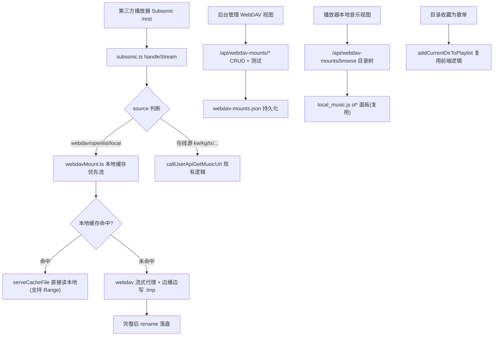
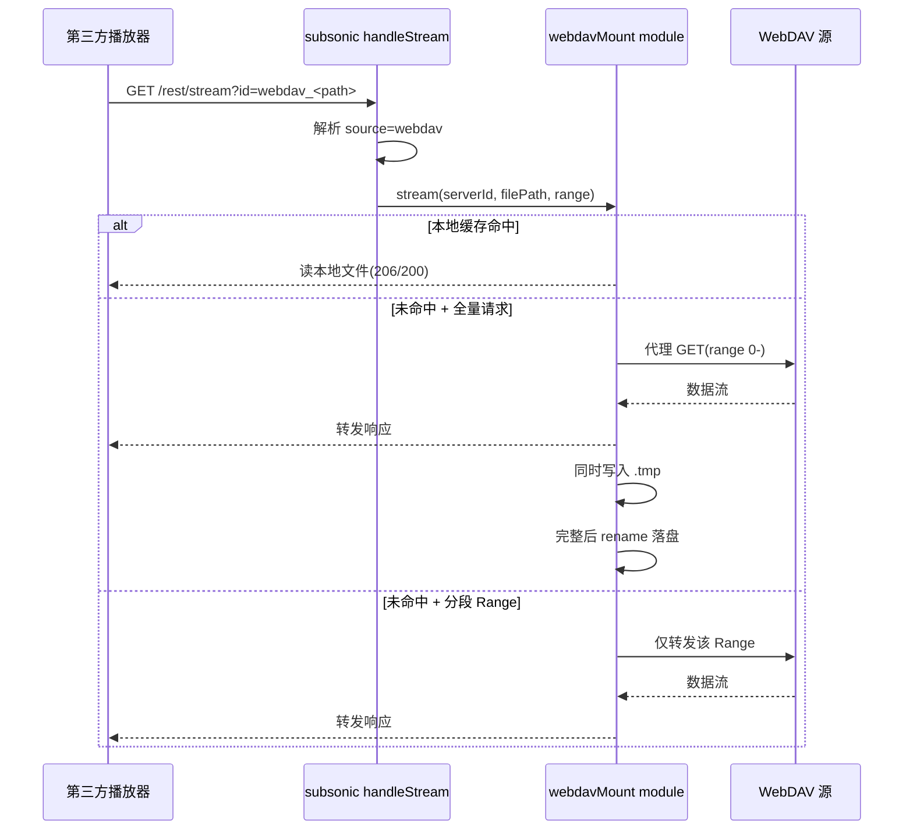

# WebDAV 音乐挂载：边播边缓存到本地 + 目录歌单

Feature Name: webdav-mount-cache
Updated: 2026-08-05

## Description

为 LX Music Sync Server 新增「WebDAV 音乐挂载」能力。后台可配置多个 WebDAV 源（独立存储于 `webdav-mounts.json`，与现有 config.js 的 `webdav.*` 备份同步互不影响）。WebDAV 歌曲采用「边播边缓存到本地」链路：第三方播放器（Subsonic /rest）请求播放时，服务端从 WebDAV 流式拉取并同步写入本地缓存目录 `<dataPath>/webdav-cache/<serverId>/`，缓存完成后直接播放本地文件。任意目录（WebDAV / OpenList / 本地缓存）可一键收藏为歌单，歌单歌曲保留来源字段（source/folder/url），无需关联在线音源即可直接播放。

设计完全复用既有 OpenList 整合的成熟模式：`src/server/openlist.ts` 的目录树扫描、流式代理、边播边缓存、缓存进度跟踪，以及前端 `local_music.js` 的目录树面板与「目录收藏为歌单」逻辑。

## Architecture





## Components and Interfaces

### 1. 新模块 `src/server/webdavMount.ts`

独立模块，管理 WebDAV 挂载源与边播边缓存，逻辑镜像 `openlist.ts`。

**数据模型（持久化 `webdav-mounts.json`）**

```ts
interface WebDAVMount {
  id: string            // crypto.randomUUID()
  name: string          // 显示名，如"我的WebDAV"
  baseUrl: string       // 如 https://alist.embyfd.cc.cd/dav/音乐/音乐
  username: string
  password: string
  rootPath: string      // 浏览根目录，默认 '/'
  enabled: boolean
  createdAt: number
}
```

**导出函数**

| 函数 | 说明 |
|---|---|
| `listMounts(): WebDAVMount[]` | 返回全部挂载源（密码字段脱敏：`hasPassword: !!password`） |
| `getMount(id): WebDAVMount \| undefined` | 按 id 获取 |
| `saveMounts()`, `addMount(m)`, `updateMount(id, patch)`, `deleteMount(id)` | CRUD + 持久化；deleteMount 同时清理 `<dataPath>/webdav-cache/<id>/` |
| `initClient(mount): Promise<Client>` | 动态 `import('webdav')` 的 `createClient`（复用 webdavSync.ts:76-101 模式），带 URL 归一化（无协议补 http://） |
| `listFiles(mount, dirPath, timeoutMs?)` | `getDirectoryContents` + 20s 超时（镜像 openlist.ts:384-389） |
| `browse(mountId, dirPath)` | 目录浏览接口，返回 `{ items: [{ name, isDir, size, mtime }] }` |
| `collectAudioFiles(mount, dirPath, ...)` | 递归收集音频，复用 openlist.ts:394-457 的防护参数（深度20/5000文件/800目录/60s/并发6），条目映射 `source='webdav'` |
| `getLocalIndex(mountId, forceRefresh?)` | TTL 120s 索引缓存，镜像 openlist.ts:462-479 |
| `getAllLocalIndex(forceRefresh?)` | 合并全部启用挂载源索引，镜像 openlist.ts:484-491 |
| `getCacheDir(mount)` / `getCacheFilePath(mount, path)` / `isFileCached` | 镜像 openlist.ts:276-289 / 364-366，目录 `webdav-cache/<id>/`，hash 命名 |
| `serveCacheFile(filePath, range, res)` | 直接复用 openlist.ts:305-342 的本地 Range 服务 |
| `stream(mount, filePath, range?)` | 原生 http/https 代理（禁止 needle，镜像 openlist.ts:257-271），递归跟随重定向 |
| `getCacheProgress / trackCacheProgress / markCacheDone / clearCacheProgress` | 镜像 openlist.ts:294-359 |
| `streamToCache(mount, filePath, res)` | **核心**：未命中缓存且全量请求时的边播边写（镜像 server.ts:4754-4795） |
| `cacheStatus(mountId?)` | 汇总：文件数/占用大小；`clearCache(mountId?)` 清空 |
| `testConnection(mountId)` | 列出 rootPath 验证连通 |
| `resolveStreamId(songmid): { mountId, filePath }` | 解析 Subsonic id 中的编码路径 |

### 2. `src/server/server.ts` 新增路由

| 路由 | 方法 | 说明 |
|---|---|---|
| `/api/webdav-mounts` | GET | 列表（脱敏） |
| `/api/webdav-mounts` | POST | 新增（管理员鉴权 `x-frontend-auth`） |
| `/api/webdav-mounts/:id` | PUT | 更新 |
| `/api/webdav-mounts/:id` | DELETE | 删除（含清理缓存） |
| `/api/webdav-mounts/:id/test` | POST | 测试连接 |
| `/api/webdav-mounts/:id/browse` | GET | 目录浏览 `?path=` |
| `/api/webdav-mounts/:id/local-list` | GET | 音频索引 `?refresh=` |
| `/api/webdav-mounts/local-list` | GET | 全部挂载合并索引 |
| `/api/webdav-mounts/stream` | GET | 播放/代理 `?server=&path=&sign=`（镜像 openlist stream 路由 server.ts:4683-4808） |
| `/api/webdav-mounts/cache/check` | GET | 单文件缓存状态 |
| `/api/webdav-mounts/cache/status` | GET | 缓存汇总 |
| `/api/webdav-mounts/cache/clear` | POST | 清空缓存（管理员） |

路由代码风格、管理员鉴权方式、`readBody` 均沿用现有 server.ts 模式。

### 3. `src/server/subsonic.ts` 扩展 handleStream

在 `handleStream`（1955）的 source/songmid 解析后（约 1976 行后）新增分支：

```ts
const LOCAL_SOURCES = ['webdav', 'openlist', 'local']
if (LOCAL_SOURCES.includes(source)) {
  // webdav: songmid 为 encodeURIComponent 后的远程路径，需 decodeURIComponent
  // 查找对应挂载源：webdav 用 path 前缀匹配 mount；openlist 从 openlist.json 取 server
  // 构造内部流 URL 并 302（或直接代理）
  //   webdav:   /api/webdav-mounts/stream?server=<id>&path=<path>
  //   openlist: /api/openlist/stream?server=<id>&path=<path>
  //   local:    解析为 /api/music/cache/file/<user>/<filename> 或本地文件直接服务
}
```

- **302 重定向**到内部流 URL，让内部流路由统一负责「本地缓存优先 + 边播边写」（Requirement 5 AC1-3），避免在 subsonic.ts 重复实现缓存逻辑
- 该分支在 `findMusicById`/`callUserApiGetMusicUrl` 之前执行，命中即返回，不落入在线源解析（Requirement 5 AC4）
- source 归属判定：`webdav_` 前缀 → webdav；`openlist_` 前缀 → openlist；`local`/本地歌曲 → local

### 4. 前端

**后台管理（`public/index.html` + `public/app.js`）**
- 新增导航 `data-view="webdav-mounts"`，镜像现有 `view-openlist`（index.html:1309-1369）
- 视图内容：挂载源列表 + 添加/编辑弹窗（name/base-url/root-path/username/password/enabled）+ 测试按钮
- JS：`loadWebdavMounts`/`renderWebdavMounts`/`showWebdavMountModal`/`saveWebdavMount`/`deleteWebdavMount`/`testWebdavMount`，镜像 app.js:2070-2201

**播放器（`public/music/`）**
- `local_music.js` 本地音乐视图：在 OpenList 面板旁新增 WebDAV 挂载源下拉/目录树（复用 `lm-ol-*` 面板与 `ol*` 方法，新增 `wm-*` 对应方法，调 browse 接口）
- 「目录收藏为歌单」复用 `addCurrentDirToPlaylist`（local_music.js:1981-2024），`buildPlaylistSong` 增加 webdav 分支（1902-1948 处，仿 openlist 豁免音源关联）
- 缓存进度徽标：镜像 openlist_manager.js:270-297 轮询 `/api/webdav-mounts/cache/check`

## Data Models

### webdav-mounts.json（`<dataPath>/`）

```json
{
  "version": 1,
  "mounts": [
    {
      "id": "wd_xxx",
      "name": "我的WebDAV",
      "baseUrl": "https://alist.example.com/dav/音乐",
      "username": "user",
      "password": "pass",
      "rootPath": "/",
      "enabled": true,
      "createdAt": 1785000000000
    }
  ]
}
```

### 音频索引条目（CacheItem 兼容，source='webdav'）

```ts
{
  id: `webdav_${encodeURIComponent(fullPath)}`,
  songmid: id, songId: id,
  name: fileName(去扩展名), singer: '', album: '',
  source: 'webdav', downloadSource: 'webdav',
  sourceName: mount.name,
  quality: ext, filename: fullPath, folder: 'webdav', subPath: dir,
  mtime, size, ext, hasCover: false, coverType: 'none', hasLyric: false,
  serverId: mount.id, path: fullPath, sign: '',
  isLocal: true, webdav: true, interval: 0,
  url: `/api/webdav-mounts/stream?server=${mount.id}&path=${encodeURIComponent(fullPath)}`
}
```

## Correctness Properties

1. **缓存完整性**：`.tmp` 写入期间，正式缓存文件不出现；仅完整下载后才 rename 落盘，中断即删除临时文件
2. **索引防护**：递归扫描受深度/文件数/目录数/总时长/并发限制，任何越界立即停止，不拖垮进程
3. **并发去重**：同一文件同时被多客户端请求时只发起一次 WebDAV 下载（单飞），后续请求共享该次下载的本地文件或等待进度
4. **密码不泄露**：任何 API 返回的挂载源条目不包含 password 明文，仅 `hasPassword`
5. **删除幂等**：删除挂载源后其缓存目录不存在残留；删除不存在的挂载源不报错
6. **不破坏现有链路**：subsonic 在线源（kw/kg/tx/wy/mg）解析逻辑保持原样；`webdav.*` 备份同步不受影响

## Error Handling

| 场景 | 处理 |
|---|---|
| WebDAV 连接失败/认证失败 | stream/索引接口返回 `{success:false, message}`；test 返回可读错误 |
| 递归扫描超时/超限 | 返回已收集部分，不抛异常（镜像 openlist.ts:394-457） |
| 下载中断（网络错误） | 清理 `.tmp`，已响应部分随流结束；下次请求重新缓存 |
| 重定向超过 N 跳 | 停止跟随并返回错误响应 |
| 挂载源不存在/被删除 | stream 返回 404 `{success:false, message:'挂载源不存在'}` |
| 密码为空 | 允许匿名 WebDAV（不传 username/password） |
| Subsonic 流解析失败 | 落入现有 `sendError(res, 0, 'Could not resolve music URL')` |

## Test Strategy

1. **单测（Node 内置 node:test）**：`webdavMount.ts` 的路径归一化、条目映射、缓存 hash 计算、resolveStreamId 解析、索引防护边界
2. **本地集成（mock WebDAV）**：用轻量 WebDAV 测试服务器（如 `webdav` npm 包的服务端或自建 http server 响应 PROPFIND/GET）验证：browse、collectAudioFiles、stream 代理、边播边写落盘、Range 请求、缓存命中秒开
3. **Subsonic 链路**：构造 `webdav_<path>` id 的 stream 请求，验证命中本地缓存分支且不调用在线源
4. **回归**：现有 openlist 播放/缓存、webdav 备份同步、在线源 subsonic 播放不受影响（手工验证 + 已有路由冒烟）
5. **前端手工**：后台 WebDAV 挂载源 CRUD/测试；播放器浏览目录树、播放、收藏为歌单、缓存徽标

## References

[^1]: (Source) - [openlist.ts 本地音乐整合与边播边缓存](/workspace/src/server/openlist.ts)
[^2]: (Source) - [server.ts OpenList stream 路由(边播边写)](file:///workspace/src/server/server.ts#L4683)
[^3]: (Source) - [subsonic.ts handleStream(在线源解析)](file:///workspace/src/server/subsonic.ts#L1955)
[^4]: (Source) - [local_music.js addCurrentDirToPlaylist 目录收藏歌单](file:///workspace/public/music/js/local_music.js#L1981)
[^5]: (Source) - [webdavSync.ts createClient 初始化模式](file:///workspace/src/utils/webdavSync.ts#L76)
